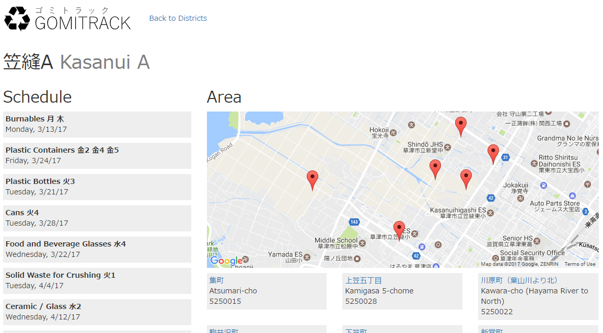

# gomitrack

## Setting Up

1. npm install
2. fill out environment variables
   - you can copy ".env.example" to ".env"
3. Fill database with information, if needed.
4. run node bin/www or npm start from bin directory.\

## Notes

There was originally a daily update feature in progress (actually, it was
sending me updates daily for about 2 years). But in order to support serverless
environment better, it's been removed.
